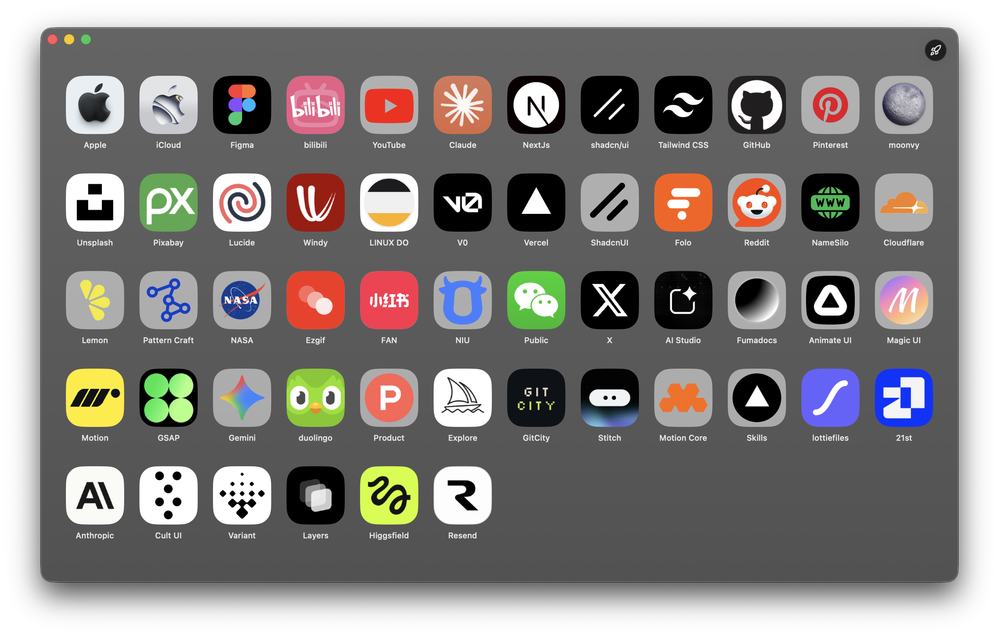
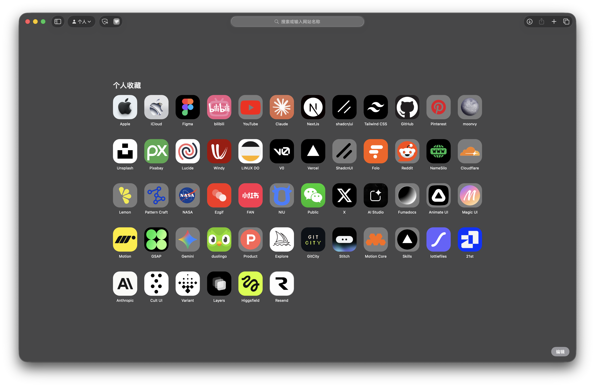

# Tabnook

Customize the icons on Safari's Start Page and Favorites bar — drop in your own artwork, pick a style, and lock the cache so Safari stops overwriting your work.

> macOS 26 (Tahoe) · SwiftUI · no network, no dependencies

| Tabnook | Safari Start Page |
| --- | --- |
|  |  |

## Install

Download the latest DMG from [Releases](../../releases), open it, and drag **Tabnook** into **Applications**.

First launch is blocked by Gatekeeper (ad-hoc signed, not notarized). Open it anyway via:

- Right-click `Tabnook.app` → **Open** → **Open**, or
- **System Settings → Privacy & Security → Open Anyway**, or
- `xattr -dr com.apple.quarantine /Applications/Tabnook.app`

## Usage

1. Launch Tabnook, click **Grant Access…**, select `~/Library/Safari/`.
2. Drop an image (PNG / JPEG / ICO / SVG) onto a site tile, or click a tile to pick a built-in style.
3. Press `⌘R` to restart Safari and see the change.
4. Press `⇧⌘L` to lock the icons folder so Safari doesn't overwrite your work.

## Privacy

Reads and writes only inside `~/Library/Safari/`. No network, no analytics, no third-party dependencies.

## Build from source

```bash
git clone https://github.com/Franvy/Tabnook.git
open Tabnook/Tabnook.xcodeproj
```

Requires Xcode 16.2+ on macOS 26.

## License

[MIT](LICENSE). Not affiliated with or endorsed by Apple.
